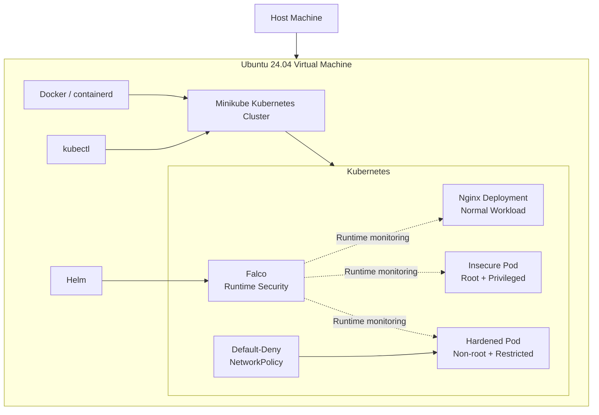
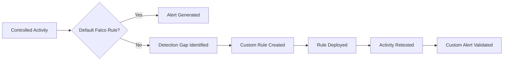

<div align="center">

# ☸️ Kubernetes Container Security & Runtime Detection Lab

### Kubernetes Security • Container Hardening • Falco • Runtime Detection • Detection Engineering

**A hands-on Kubernetes security lab demonstrating insecure workload analysis, runtime threat detection, custom Falco rule engineering, container hardening, network isolation, and post-hardening validation.**


**Minikube • Docker • kubectl • Helm • Nginx • Falco • NetworkPolicy**

</div>

---

## 📌 Project Overview

This project builds a local Kubernetes security lab inside an Ubuntu virtual machine and demonstrates the full defensive workflow:

```text
Deploy → Identify Weaknesses → Test → Detect → Engineer Rules → Harden → Verify
```

The environment was used to:

- Build and operate a local Kubernetes cluster.
- Deploy a containerised Nginx workload.
- Create an intentionally insecure privileged pod.
- Identify insecure container configurations.
- Deploy Falco for runtime security monitoring.
- Generate controlled suspicious activity inside containers.
- Measure default Falco detection coverage.
- Engineer and validate a custom Falco rule.
- Harden Kubernetes workloads using security contexts.
- Apply a default-deny NetworkPolicy.
- Compare insecure and hardened configurations.

> **Authorisation Notice**
>
> All testing was performed inside a self-owned, isolated lab environment for educational and cybersecurity training purposes.

---

## 🏆 Project Highlights

| Capability | Result |
|---|---|
| Local Kubernetes cluster | ✅ Minikube operational |
| Nginx workload deployment | ✅ Running and accessible |
| Insecure workload baseline | ✅ Root + privileged pod |
| Runtime monitoring | ✅ Falco deployed |
| Sensitive-file detection | ✅ `/etc/shadow` access detected |
| Detection-gap analysis | ✅ Three default-rule gaps documented |
| Custom Falco detection | ✅ `/etc` write rule created and validated |
| Non-root hardening | ✅ Implemented |
| Privilege escalation control | ✅ Disabled |
| Linux capability reduction | ✅ All dropped |
| Read-only root filesystem | ✅ Implemented |
| Resource limits | ✅ CPU + memory |
| Network isolation | ✅ Default-deny NetworkPolicy |
| Troubleshooting | ✅ Read-only filesystem issue resolved |
| Documentation | ✅ Reports, screenshots, manifests, diagrams |

---

# 🏗️ Architecture




---

## 🧰 Environment

| Component | Configuration |
|---|---|
| Operating System | Ubuntu 24.04 LTS |
| Hypervisor | Oracle VirtualBox |
| CPU | 4 vCPUs |
| RAM | 8 GB |
| Virtual Storage | 50 GB |
| Container Platform | Docker / containerd |
| Kubernetes | Minikube |
| Kubernetes CLI | kubectl |
| Package Deployment | Helm |
| Runtime Security | Falco |
| Application Workload | Nginx |

---

# 🔄 Security Workflow

```mermaid
flowchart LR
    A["Deploy Workload"] --> B["Identify Weaknesses"]
    B --> C["Controlled Security Tests"]
    C --> D["Observe Falco Coverage"]
    D --> E["Identify Detection Gaps"]
    E --> F["Create Custom Rule"]
    F --> G["Validate Detection"]
    G --> H["Harden Workload"]
    H --> I["Verify Security Controls"]
```



---

# 1️⃣ Kubernetes Environment Setup

The project began by building a local Kubernetes environment using:

- Git
- Docker
- kubectl
- Minikube
- Helm

The cluster was started with:

```bash
minikube start \
  --driver=docker \
  --container-runtime=containerd \
  --cpus=4 \
  --memory=6144
```

Cluster health was verified using:

```bash
kubectl get nodes
kubectl get pods -A
```

### Result

> ✅ **Minikube control-plane node reached `Ready` state and Kubernetes system pods were operational.**

### Evidence


---

# 2️⃣ Nginx Workload Deployment

A simple Nginx workload was deployed to establish a normal Kubernetes application baseline.

### Deployment Manifest

```text
manifests/nginx-deployment.yaml
```

### Service Manifest

```text
manifests/nginx-service.yaml
```

The deployment used:

```text
nginx:1.27-alpine
```

The application was exposed using a NodePort service.

### Verification

```bash
kubectl get deployments,pods,services
minikube service nginx-service --url
```

### Result

> ✅ **Nginx Deployment reported `1/1` ready replicas and the application was accessible through Minikube.**

### Evidence


---

# 3️⃣ Insecure Workload Baseline

An intentionally insecure pod was created to demonstrate common container-security weaknesses.

Manifest:

```text
manifests/insecure-pod.yaml
```

The pod was configured with:

```yaml
securityContext:
  privileged: true
```

Runtime identity verification:

```bash
kubectl exec insecure-pod -- id
```

Output:

```text
uid=0(root)
```

### Identified Weaknesses

| Security Control | Insecure State |
|---|---|
| Container user | Root |
| Privileged mode | Enabled |
| CPU limits | None |
| Memory limits | None |
| NetworkPolicy | None |

### Security Impact

Running as root and enabling privileged mode significantly increases the potential impact of a container compromise.

### Evidence


---

# 4️⃣ Falco Runtime Monitoring

Falco was installed using Helm in a dedicated namespace.

```bash
helm repo add falcosecurity https://falcosecurity.github.io/charts
helm repo update
```

```bash
helm install --replace falco \
  --namespace falco \
  --create-namespace \
  --set tty=true \
  falcosecurity/falco
```

Falco readiness was verified with:

```bash
kubectl wait pods \
  --for=condition=Ready \
  --all \
  -n falco \
  --timeout=180s
```

### Evidence


---

## 🚨 Confirmed Runtime Detection

A controlled test accessed:

```text
/etc/shadow
```

from inside the Nginx container:

```bash
kubectl exec -it deployment/nginx-lab -- cat /etc/shadow
```

Falco logs were reviewed:

```bash
kubectl logs \
  -n falco \
  -l app.kubernetes.io/name=falco \
  -c falco \
  --since=5m | grep Warning
```

Falco generated:

```text
Warning Sensitive file opened for reading by non-trusted program
```

The alert included context such as:

- Sensitive file
- User
- Process
- Command
- Container name
- Container image
- Kubernetes pod
- Kubernetes namespace

### Result

> ✅ **Runtime monitoring successfully detected sensitive-file access inside the container.**

### Evidence


---

# 5️⃣ Controlled Security Testing

Three additional runtime behaviours were tested.

| Test | Action | Default Falco Result |
|---|---|---|
| Test 1 | Interactive shell in Nginx | ❌ Not detected |
| Test 2 | File written below `/etc` | ❌ Not detected |
| Test 3 | Privileged pod deployment | ❌ Not detected |
| Runtime Test | Read `/etc/shadow` | ✅ Detected |

---

## Test 1 — Interactive Container Shell

```bash
kubectl exec -it deployment/nginx-lab -- /bin/sh
```

### Result

> ❌ **No corresponding Falco warning was observed.**

### Security Significance

Interactive shell access allows a user with sufficient Kubernetes permissions to execute arbitrary commands inside a running workload.

### Evidence


Full report:

```text
reports/test-01-container-shell.md
```

---

## Test 2 — Write Below `/etc`

```bash
kubectl exec deployment/nginx-lab -- \
  sh -c 'touch /etc/test_file_for_falco_rule'
```

### Initial Result

> ❌ **Not detected by the default Falco ruleset.**

This became the basis for the project's custom detection-engineering exercise.

### Evidence


Full report:

```text
reports/test-02-file-write-etc.md
```

---

## Test 3 — Privileged Pod Deployment

```bash
kubectl delete pod insecure-pod --ignore-not-found
kubectl apply -f insecure-pod.yaml
kubectl get pod insecure-pod
```

### Result

> ❌ **No corresponding Falco warning was observed.**

### Evidence


Full report:

```text
reports/test-03-privileged-pod.md
```

---

# 🧠 Custom Falco Detection Engineering

The `/etc` write test was not detected by the default rule set.

Instead of treating this as a failure, detection coverage was extended by creating a custom Falco rule.

Custom rule file:

```text
falco/falco-custom-rules.yaml
```

## Custom Rule

```yaml
- rule: Write below etc
  desc: Detect attempts to open files below /etc for writing
  condition: >
    (evt.type in (open,openat,openat2) and evt.is_open_write=true and fd.typechar='f' and fd.num>=0)
    and fd.name startswith /etc
  output: >
    File below /etc opened for writing |
    file=%fd.name
    user=%user.name
    process=%proc.name
    command=%proc.cmdline
    container=%container.name
    image=%container.image.repository
    pod=%k8s.pod.name
    namespace=%k8s.ns.name
  priority: WARNING
  tags: [filesystem, mitre_persistence]
```

---

## Deploying the Custom Rule

The Falco Helm deployment was upgraded:

```bash
helm upgrade falco falcosecurity/falco \
  --namespace falco \
  --reuse-values \
  -f falco/falco-custom-rules.yaml
```

Falco validated the rule:

```text
/etc/falco/rules.d/custom-rules.yaml | schema validation: ok
```

---

## Retesting

The same write activity was repeated:

```bash
kubectl exec deployment/nginx-lab -- \
  touch /etc/test_file_for_falco_rule
```

Logs were queried:

```bash
kubectl logs \
  -n falco \
  -l app.kubernetes.io/name=falco \
  -c falco \
  --since=1m | grep "File below /etc"
```

Falco generated:

```text
Warning File below /etc opened for writing |
file=/etc/test_file_for_falco_rule
user=root
process=touch
command=touch /etc/test_file_for_falco_rule
container=nginx
image=docker.io/library/nginx
namespace=default
```

### Detection Improvement

| Stage | Test | Result |
|---|---|---|
| Default Falco rules | Write below `/etc` | ❌ Not detected |
| Custom Falco rule | Write below `/etc` | ✅ Detected |

> **This demonstrates a complete detection-engineering loop: identify a coverage gap → write a rule → deploy it → retest → validate the alert.**

### Evidence


Full report:

```text
reports/test-04-custom-falco-rule.md
```

---

# 6️⃣ Kubernetes Workload Hardening

The insecure workload was replaced with a hardened pod.

Manifest:

```text
manifests/hardened-pod.yaml
```

Image:

```text
nginxinc/nginx-unprivileged:alpine
```

---

## 🔐 Non-Root Execution

```yaml
runAsNonRoot: true
runAsUser: 101
runAsGroup: 101
```

Verified with:

```bash
kubectl exec hardened-pod -- id
```

### Result

> ✅ **Container runs using a non-zero UID instead of root.**

### Evidence


---

## 🚫 Privilege Escalation Disabled

```yaml
allowPrivilegeEscalation: false
```

This prevents processes from gaining additional privileges inside the container.

---

## ✂️ Linux Capabilities Dropped

```yaml
capabilities:
  drop:
    - ALL
```

This reduces the privileged operations available to the application.

---

## 📁 Read-Only Root Filesystem

```yaml
readOnlyRootFilesystem: true
```

The first hardened deployment failed because Nginx required writable temporary storage:

```text
mkdir() "/tmp/proxy_temp" failed (30: Read-only file system)
```

Instead of removing the security control, a dedicated writable temporary volume was mounted:

```yaml
volumeMounts:
  - name: nginx-tmp
    mountPath: /tmp

volumes:
  - name: nginx-tmp
    emptyDir: {}
```

### Result

> ✅ **Nginx remained functional while the main root filesystem stayed read-only.**

This demonstrates security-conscious troubleshooting rather than weakening the hardening configuration.

---

## 📦 Resource Limits

```yaml
resources:
  requests:
    cpu: "50m"
    memory: "64Mi"
  limits:
    cpu: "100m"
    memory: "128Mi"
```

These controls reduce the risk of excessive resource consumption.

### Evidence


---

# 🌐 Default-Deny NetworkPolicy

A default-deny NetworkPolicy was created:

```text
manifests/default-deny-networkpolicy.yaml
```

```yaml
apiVersion: networking.k8s.io/v1
kind: NetworkPolicy
metadata:
  name: default-deny
spec:
  podSelector: {}
  policyTypes:
    - Ingress
    - Egress
```

Applied with:

```bash
kubectl apply -f default-deny-networkpolicy.yaml
```

Verified using:

```bash
kubectl get networkpolicy
kubectl describe networkpolicy default-deny
```

### Result

> ✅ **Selected pods were configured for ingress and egress isolation.**

### Evidence


---

# 📈 Before vs After

| Security Control | Insecure Workload | Hardened Workload |
|---|---|---|
| Container user | Root (`uid=0`) | Non-root (`uid=101`) |
| Privileged mode | Enabled | Not enabled |
| Privilege escalation | Unrestricted | Disabled |
| Linux capabilities | Default | All dropped |
| Root filesystem | Writable | Read-only |
| Writable temp storage | Broad | Dedicated `/tmp` |
| CPU limits | None | Configured |
| Memory limits | None | Configured |
| NetworkPolicy | None | Default deny |
| Runtime monitoring | None | Falco enabled |
| Custom detection | None | `/etc` write rule |

---

# 🔬 Detection Coverage Summary



### Detection Results

| Activity | Default Rules | Custom Rule |
|---|---:|---:|
| `/etc/shadow` read | ✅ Detected | Not required |
| Interactive shell | ❌ Not detected | Not implemented |
| Write below `/etc` | ❌ Not detected | ✅ Detected |
| Privileged pod deployment | ❌ Not detected | Not implemented |

This demonstrates that runtime security tooling depends on **rule coverage**, not merely tool installation.

---

# 💡 Key Lessons Learned

### 1. Runtime monitoring requires meaningful rules

Falco was operational, but not every suspicious action triggered a default alert.

### 2. Detection gaps can become engineering opportunities

The failed `/etc` write detection was used to create, deploy, and validate a custom Falco rule.

### 3. Security controls can affect application compatibility

A read-only root filesystem caused an Nginx startup issue because `/tmp` needed to remain writable.

### 4. Hardening should preserve functionality

A dedicated `emptyDir` volume solved the compatibility issue without disabling the read-only filesystem control.

### 5. Container security is layered

No single control is sufficient. The hardened workload combines identity restrictions, filesystem controls, capability reduction, resource limits, network isolation, and runtime monitoring.

---

# 📸 Evidence Gallery

<table>
<tr>
<td width="50%">

**Cluster Ready**


</td>
<td width="50%">

**Nginx Running**


</td>
</tr>

<tr>
<td width="50%">

**Insecure Root Container**


</td>
<td width="50%">

**Falco Runtime Alert**


</td>
</tr>

<tr>
<td width="50%">

**Hardened Non-Root Pod**


</td>
<td width="50%">

**Custom Falco Detection**


</td>
</tr>
</table>

---

# 📁 Repository Structure

```text
kubernetes-container-security-lab/
│
├── README.md
│
├── diagrams/
│   └── architecture.png
│
├── manifests/
│   ├── nginx-deployment.yaml
│   ├── nginx-service.yaml
│   ├── insecure-pod.yaml
│   ├── hardened-pod.yaml
│   └── default-deny-networkpolicy.yaml
│
├── falco/
│   ├── notes-and-alerts.md
│   └── falco-custom-rules.yaml
│
├── screenshots/
│   ├── day1-cluster-ready.png
│   ├── day1-system-pods.png
│   ├── day2-nginx-running.png
│   ├── day2-nginx-website.png
│   ├── day3-insecure-root.png
│   ├── day3-privileged-context.png
│   ├── day4-falco-running.png
│   ├── day4-falco-alert.png
│   ├── day5-test1-container-shell.png
│   ├── day5-test2-file-write-etc.png
│   ├── day5-test3-privileged-pod.png
│   ├── day6-hardened-nonroot.png
│   ├── day6-hardened-security-context.png
│   ├── day6-networkpolicy.png
│   └── custom-falco-rule-detected.png
│
├── reports/
│   ├── final-summary.md
│   ├── day6-hardening-summary.md
│   ├── test-01-container-shell.md
│   ├── test-02-file-write-etc.md
│   ├── test-03-privileged-pod.md
│   └── test-04-custom-falco-rule.md
│
└── docs/
    ├── final-project-report.md
    └── final-project-report.pdf
```

---

# ⚠️ Limitations

This project intentionally uses a simplified local environment.

Current limitations include:

- Single-node Minikube cluster
- Local VirtualBox environment rather than a production cloud cluster
- Simple Nginx workload
- No centralised SIEM integration
- Default Falco rules did not detect every controlled security test
- NetworkPolicy enforcement depends on the Kubernetes networking implementation
- No Kubernetes audit-log monitoring
- No admission-controller security policies

These limitations are documented intentionally to avoid overstating the environment.

---

# 🚀 Future Improvements

Potential extensions include:

- Forward Falco alerts to Wazuh
- Create additional custom Falco detection rules
- Enable Kubernetes audit logging
- Deploy Calico and perform full NetworkPolicy connectivity testing
- Add Pod Security Admission controls
- Integrate centralised SIEM monitoring
- Deploy the environment to Azure or AWS
- Add automated security scanning to a CI/CD pipeline
- Add policy-as-code controls
- Add regression tests for Falco rules

---

# 🧰 Skills Demonstrated

<div align="center">


</div>

- Kubernetes administration
- Container security
- Runtime security monitoring
- Falco deployment
- Falco rule engineering
- Detection-gap analysis
- Linux container security
- SecurityContext hardening
- Non-root execution
- Linux capability management
- Read-only filesystem controls
- Resource requests and limits
- Kubernetes NetworkPolicy
- Helm
- kubectl
- Docker / containerd
- Troubleshooting
- Security validation
- Git / GitHub documentation

---

# 🎓 Portfolio Value

This project demonstrates more than simply deploying Kubernetes.

It shows the ability to:

1. Build and operate a Kubernetes environment.
2. Deploy and expose containerised workloads.
3. Identify insecure container configurations.
4. Generate controlled runtime security events.
5. Deploy and validate a runtime detection platform.
6. Identify gaps in default detection coverage.
7. Engineer and test a custom Falco rule.
8. Harden containers using multiple security controls.
9. Troubleshoot compatibility problems without removing security protections.
10. Compare insecure and hardened states.
11. Document findings and limitations accurately.

> **The result is an end-to-end Kubernetes Container Security and Runtime Detection Lab with practical evidence of both security hardening and detection engineering.**

---

## ⚖️ Disclaimer

This repository is for **educational and authorised cybersecurity laboratory use only**.

All testing was performed inside a self-owned, isolated virtual environment.

---

<div align="center">

### ☸️ Build the cluster. 🔍 Observe the runtime. 🛡️ Harden the workload.

**Kubernetes • Falco • Container Security • Detection Engineering**

</div>
