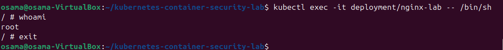
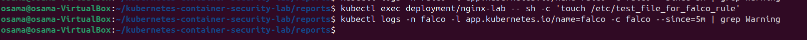
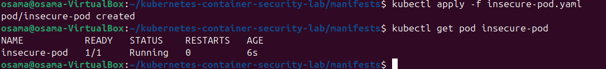
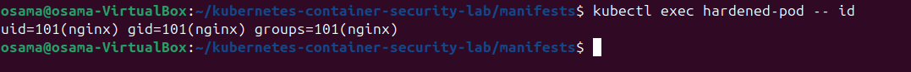
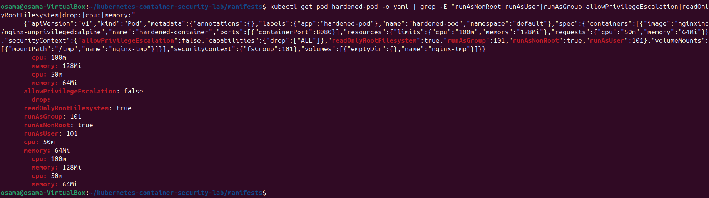
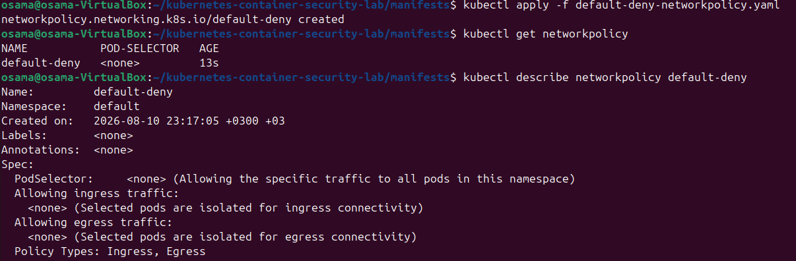
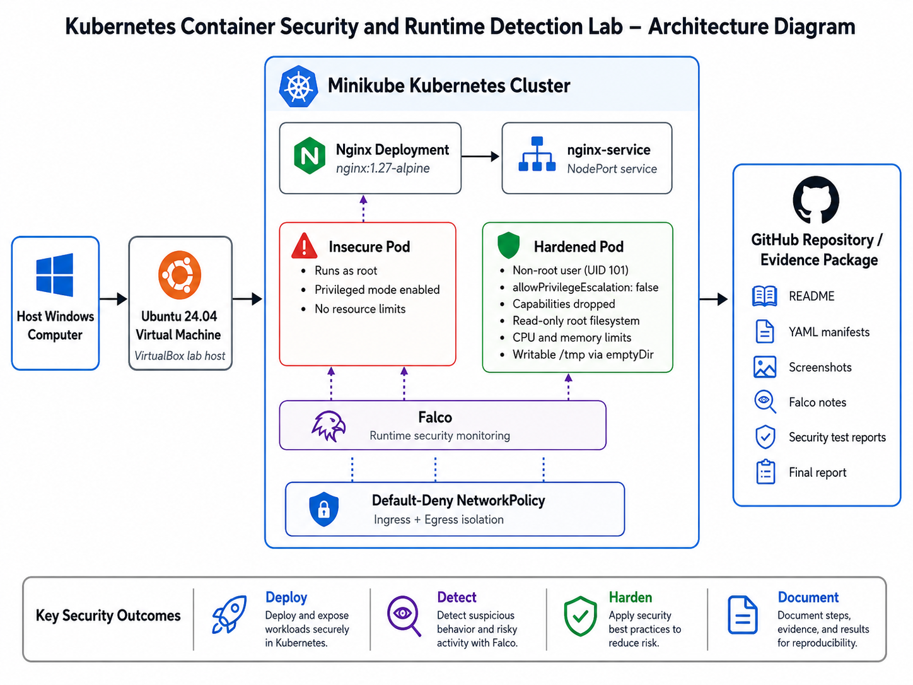
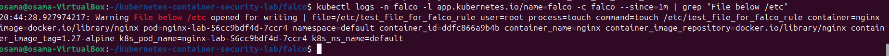

# Kubernetes Container Security and Runtime Detection Lab

A hands-on Kubernetes security project using Minikube, Nginx, Falco, and container hardening techniques.

## Project Status

In Progress

---

# Day 1 - Local Kubernetes Environment

## Goal

Set up a local Kubernetes environment inside an Ubuntu virtual machine and verify that the cluster is functioning correctly.

## Environment

The lab environment consists of:

- Ubuntu 24.04 LTS
- Oracle VirtualBox
- Docker
- kubectl
- Minikube
- Helm
- Git

The virtual machine was configured with:

- 4 CPU cores
- 8 GB RAM
- 50 GB virtual storage

---

## Tools Installed

### Git

Git was installed for project and repository management.

```bash
sudo apt install -y git
```

The installation was verified using:

```bash
git --version
```

---

### Docker

Docker was installed to provide the container environment required by Minikube.

```bash
sudo apt install -y docker.io
```

Docker was enabled and started:

```bash
sudo systemctl enable --now docker
```

The current user was added to the Docker group:

```bash
sudo usermod -aG docker $USER
```

Docker functionality was verified using:

```bash
docker run --rm hello-world
```

The test completed successfully, confirming that Docker was operational.

---

### kubectl

kubectl was installed to allow interaction with the Kubernetes cluster.

```bash
curl -LO "https://dl.k8s.io/release/$(curl -L -s https://dl.k8s.io/release/stable.txt)/bin/linux/amd64/kubectl"
```

The binary was installed using:

```bash
sudo install -o root -g root -m 0755 kubectl /usr/local/bin/kubectl
```

The installation was verified using:

```bash
kubectl version --client
```

---

### Minikube

Minikube was installed to create a local single-node Kubernetes cluster.

```bash
curl -LO https://storage.googleapis.com/minikube/releases/latest/minikube-linux-amd64
```

The Minikube binary was installed using:

```bash
sudo install minikube-linux-amd64 /usr/local/bin/minikube
```

The installation was verified using:

```bash
minikube version
```

---

### Helm

Helm was installed to manage Kubernetes applications and will later be used to deploy Falco.

```bash
curl https://raw.githubusercontent.com/helm/helm/main/scripts/get-helm-3 | bash
```

The installation was verified using:

```bash
helm version
```

---

# Kubernetes Cluster Deployment

The local Kubernetes cluster was created using Minikube.

The Docker driver was selected and the cluster was configured with 4 CPUs and approximately 6 GB of memory.

```bash
minikube start --driver=docker --container-runtime=containerd --cpus=4 --memory=6144
```

Minikube successfully created the Kubernetes cluster and configured kubectl to communicate with it.

---

# Kubernetes Node Verification

The Kubernetes node was checked using:

```bash
kubectl get nodes
```

The Minikube control-plane node successfully reported a:

```text
Ready
```

status.

This confirmed that the Kubernetes control-plane node was operational.

## Evidence


The screenshot above confirms that the Minikube Kubernetes node is running successfully with a `Ready` status.

---

# Kubernetes System Pod Verification

The Kubernetes system components were checked using:

```bash
kubectl get pods -A
```

This command displays pods running across all Kubernetes namespaces.

The Kubernetes system pods were confirmed to be operational.

## Evidence


The screenshot above shows the Kubernetes system components running inside the Minikube cluster.

---

# Day 1 Success Checks

- [x] Ubuntu 24.04 LTS virtual machine configured
- [x] Internet connectivity confirmed
- [x] Git installed
- [x] Docker installed
- [x] Docker functionality verified
- [x] kubectl installed
- [x] Minikube installed
- [x] Helm installed
- [x] Minikube cluster created
- [x] Kubernetes control-plane node is `Ready`
- [x] Kubernetes system pods are operational

---

# Day 1 Result

Day 1 was completed successfully.

A functional local Kubernetes environment was created using Minikube inside an Ubuntu 24.04 LTS virtual machine.

Docker was configured as the local container platform, while kubectl was installed for Kubernetes cluster management. Minikube successfully created the local Kubernetes cluster, and Helm was installed for application deployment later in the project.

The Kubernetes control-plane node was verified as being in a `Ready` state, and the Kubernetes system components were confirmed to be operational.

The environment is now ready for the next stage of the project, where an Nginx workload will be deployed inside Kubernetes.

---

# Next Step

## Day 2 - Deploy the Nginx Workload

The next stage of the project will:

- Create an Nginx Kubernetes Deployment
- Create a Kubernetes Service
- Deploy the Nginx container
- Verify the pod is running
- Access the Nginx website through Minikube
- Document the deployment with screenshots

---

# Authorization

All testing performed as part of this project is conducted inside a self-owned local lab environment for educational and cybersecurity training purposes.

---

# Day 2 - Deploy the Nginx Workload

## Goal

Deploy a simple Nginx web application inside the Kubernetes cluster and verify that it can be accessed successfully.

## Kubernetes Deployment

An Nginx Deployment manifest was created inside the `manifests` directory:

```text
manifests/nginx-deployment.yaml
```

The deployment uses the `nginx:1.27-alpine` container image and runs one replica.

The deployment was applied using:

```bash
kubectl apply -f nginx-deployment.yaml
```

The deployment and pod status were checked using:

```bash
kubectl get deployments,pods
```

The Nginx deployment successfully reported `1/1` ready replicas and the Nginx pod entered the `Running` state.

---

## Kubernetes Service

A NodePort Service was created to expose the Nginx application:

```text
manifests/nginx-service.yaml
```

The service was deployed using:

```bash
kubectl apply -f nginx-service.yaml
```

All Nginx Kubernetes resources were then verified using:

```bash
kubectl get deployments,pods,services
```

The command confirmed that:

- The `nginx-lab` deployment was running
- The Nginx pod was in the `Running` state
- The `nginx-service` NodePort service was successfully created

## Evidence


The screenshot above shows the Nginx Deployment, Pod, and Service running inside the Kubernetes cluster.

---

## Accessing the Nginx Website

The Minikube service command was used to obtain a local URL for the Nginx application:

```bash
minikube service nginx-service --url
```

The generated URL was opened inside the Ubuntu web browser.

The default Nginx welcome page loaded successfully, confirming that traffic could reach the Kubernetes workload through the configured service.

## Evidence


The screenshot above confirms that the Nginx web application is accessible through the Minikube service.

---

## Day 2 Success Checks

- [x] Nginx Deployment manifest created
- [x] Nginx Service manifest created
- [x] Nginx Deployment applied successfully
- [x] Deployment shows `1/1` ready replicas
- [x] Nginx pod is `Running`
- [x] `nginx-service` is available
- [x] Nginx welcome page is accessible
- [x] Kubernetes manifests added to the GitHub repository

---

## Day 2 Result

Day 2 was completed successfully.

An Nginx web application was deployed inside the local Kubernetes cluster using a Kubernetes Deployment. A NodePort Service was then created to expose the workload.

The deployment, pod, and service were verified using kubectl, and the Nginx welcome page was successfully accessed through Minikube.

This confirms that the Kubernetes environment can successfully deploy, run, and expose containerized applications.

---

## Next Step

### Day 3 - Create and Verify an Insecure Pod

The next stage will intentionally deploy an insecure Kubernetes pod in order to demonstrate common container security weaknesses, including:

- Running a container as the root user
- Enabling privileged mode
- Running without resource limits
- Operating without a NetworkPolicy

These weaknesses will later be compared against a hardened Kubernetes workload.

---

# Day 3 - Create and Verify an Insecure Pod

## Goal

Deploy an intentionally insecure Kubernetes pod and identify common container security weaknesses before applying hardening controls.

## Insecure Pod Deployment

An Ubuntu pod was created using:

```text
manifests/insecure-pod.yaml
```

The pod was intentionally configured with privileged mode enabled.

The manifest was deployed using:

```bash
kubectl apply -f insecure-pod.yaml
```

The pod status was checked using:

```bash
kubectl get pod insecure-pod -o wide
```

The pod successfully entered the `Running` state.

---

## Root User Verification

The user identity inside the container was checked using:

```bash
kubectl exec insecure-pod -- id
```

The output confirmed:

```text
uid=0(root)
```

This means the container is running as the root user.

### Security Risk

Running a container as root increases the potential impact of a compromise because processes inside the container have elevated privileges.

### Evidence


---

## Privileged Mode Verification

The pod manifest was inspected and confirmed to contain:

```yaml
securityContext:
  privileged: true
```

### Security Risk

Privileged containers weaken normal container isolation and provide significantly greater access to the underlying environment.

### Evidence


---

## Additional Security Findings

The insecure workload also contains the following weaknesses:

- No CPU resource limits
- No memory resource limits
- No Kubernetes NetworkPolicy

NetworkPolicy configuration was checked using:

```bash
kubectl get networkpolicy
```

No NetworkPolicy was configured at this stage.

---

## Day 3 Success Checks

- [x] Insecure pod deployed
- [x] Pod status is `Running`
- [x] Container confirmed to run as root
- [x] `privileged: true` confirmed
- [x] No resource limits identified
- [x] No NetworkPolicy configured
- [x] Security findings documented
- [x] Evidence screenshots added

---

## Day 3 Result

Day 3 was completed successfully.

An intentionally insecure Kubernetes workload was deployed and inspected. The container was confirmed to run as the root user with privileged mode enabled.

Additional weaknesses were identified, including the absence of CPU and memory limits and the lack of a NetworkPolicy.

These findings create the insecure baseline that will later be compared against a hardened Kubernetes workload.

---

## Next Step

### Day 4 - Install Falco and Capture a Runtime Security Alert

The next stage will introduce runtime security monitoring using Falco.

Falco will be installed into the Kubernetes cluster using Helm, and a controlled test event will be generated inside the Nginx container to confirm that suspicious runtime activity can be detected.

---

# Day 4 - Install Falco and Capture a Runtime Security Alert

## Goal

Install Falco inside the Kubernetes cluster and verify that suspicious runtime activity inside a container can be detected.

---

## Falco Installation

The official Falco Helm repository was added using:

```bash
helm repo add falcosecurity https://falcosecurity.github.io/charts
helm repo update
```

Falco was then installed in a dedicated Kubernetes namespace:

```bash
helm install --replace falco \
  --namespace falco \
  --create-namespace \
  --set tty=true \
  falcosecurity/falco
```

The installation completed successfully with the Falco release deployed into the `falco` namespace.

---

## Falco Pod Verification

The Falco pod was checked for readiness using:

```bash
kubectl wait pods --for=condition=Ready --all -n falco --timeout=180s
```

The pod successfully reached the `Ready` condition.

Falco pod status was then checked using:

```bash
kubectl get pods -n falco
```

The Falco pod was confirmed to be running successfully.

### Evidence


---

## Runtime Detection Test

A controlled security event was generated by accessing the sensitive `/etc/shadow` file from inside the Nginx container:

```bash
kubectl exec -it deployment/nginx-lab -- cat /etc/shadow
```

Falco logs were then reviewed using:

```bash
kubectl logs -n falco -l app.kubernetes.io/name=falco -c falco --since=5m | grep Warning
```

Falco successfully generated a runtime security warning.

The alert identified:

- Sensitive file: `/etc/shadow`
- User: `root`
- Process: `cat`
- Command: `cat /etc/shadow`
- Container: `nginx`
- Image: `nginx:1.27-alpine`
- Kubernetes namespace: `default`
- Kubernetes Nginx pod

### Detection

```text
Warning Sensitive file opened for reading by non-trusted program
```

### Evidence


---

## Security Significance

Access to `/etc/shadow` is security-sensitive because it contains protected user authentication information.

Falco successfully detected this activity at runtime and provided useful investigation context about the process, command, container, image, pod, and namespace involved.

This demonstrates how runtime monitoring can help identify suspicious activity occurring inside Kubernetes workloads.

---

## Day 4 Success Checks

- [x] Falco Helm repository added
- [x] Falco installed using Helm
- [x] Falco namespace created
- [x] Falco pod reached `Ready`
- [x] Falco pod confirmed as `Running`
- [x] Controlled runtime security event generated
- [x] Falco warning successfully captured
- [x] Alert contains container and Kubernetes context
- [x] Falco alert documented
- [x] Evidence screenshots added

---

## Day 4 Result

Day 4 was completed successfully.

Falco was deployed inside the Kubernetes cluster using Helm and confirmed to be operational.

A controlled security event was generated inside the Nginx container by accessing `/etc/shadow`. Falco detected the activity and produced a warning containing useful runtime information, including the process, command, container image, Kubernetes pod, and namespace.

This confirms that the lab environment is capable of detecting suspicious runtime activity inside Kubernetes containers.

---

## Next Step

### Day 5 - Controlled Security Testing

The next stage will perform three controlled security tests:

1. Interactive shell access inside the Nginx container
2. Writing a file below `/etc`
3. Deploying the privileged insecure pod

Each test will be documented with its objective, command, result, security risk, detection status, and recommended mitigation.

---

# Day 5 - Controlled Security Testing

## Goal

Perform three controlled security tests inside the local Kubernetes lab and document the behavior, risks, and Falco detection results.

The tests were performed only inside the self-owned local environment.

---

## Test 1 - Interactive Shell in Nginx

An interactive shell was opened inside the running Nginx container using:

```bash
kubectl exec -it deployment/nginx-lab -- /bin/sh
```

The `whoami` command was then executed inside the container to confirm command execution.

### Result

The interactive shell opened successfully.

Falco logs were checked using:

```bash
kubectl logs -n falco -l app.kubernetes.io/name=falco -c falco --since=5m | grep Warning
```

No corresponding Falco warning was generated.

### Falco Detection

**Not detected**

### Security Risk

Interactive shell access allows a user with sufficient Kubernetes permissions to execute commands directly inside a running container.

If an attacker obtains this level of access, they may inspect files, modify application data, or attempt further actions from inside the workload.

### Evidence



Full test report:

```text
reports/test-01-container-shell.md
```

---

## Test 2 - File Written Below /etc

A test file was created inside the `/etc` directory of the Nginx container using:

```bash
kubectl exec deployment/nginx-lab -- sh -c 'touch /etc/test_file_for_falco_rule'
```

Falco logs were then reviewed.

### Result

The file-write command completed successfully.

No corresponding Falco warning was generated by the installed default rules.

### Falco Detection

**Not detected**

### Security Risk

Unexpected changes below `/etc` may indicate configuration tampering or unauthorized system-level modifications inside a container.

### Evidence



Full test report:

```text
reports/test-02-file-write-etc.md
```

---

## Test 3 - Privileged Pod Deployment

The existing insecure pod was deleted and recreated using:

```bash
kubectl delete pod insecure-pod --ignore-not-found
kubectl apply -f insecure-pod.yaml
kubectl get pod insecure-pod
```

The privileged pod successfully entered the `Running` state.

Falco logs were checked for a related warning.

### Result

The privileged pod was successfully deployed.

No corresponding Falco warning was generated by the installed default rule set.

### Falco Detection

**Not detected**

### Security Risk

Privileged containers weaken normal container isolation and may expose greater access to the underlying host environment.

### Evidence



Full test report:

```text
reports/test-03-privileged-pod.md
```

---

## Detection Summary

| Test | Result | Falco Detection |
|---|---|---|
| Interactive shell in Nginx | Successful | Not detected |
| File written below `/etc` | Successful | Not detected |
| Privileged pod deployment | Successful | Not detected |

Although these three tests did not trigger default Falco alerts in this installation, Day 4 successfully produced a confirmed Falco warning when `/etc/shadow` was accessed from inside the Nginx container.

This demonstrates that detection coverage depends on the enabled Falco rules and that custom rules may be required for additional runtime behaviors.

---

## Day 5 Success Checks

- [x] Interactive shell test completed
- [x] File-write test completed
- [x] Privileged pod deployment test completed
- [x] Each test documented
- [x] Security risk recorded for each test
- [x] Falco detection result recorded for each test
- [x] Detection limitations documented
- [x] Day 4 confirmed Falco detection retained as runtime evidence
- [x] Screenshots added
- [x] Test reports added to the repository

---

## Day 5 Result

Day 5 was completed successfully.

Three controlled Kubernetes security tests were performed and documented.

All three actions were successfully executed, but the installed default Falco rules did not generate alerts for these specific behaviors.

This result demonstrates an important security monitoring lesson: runtime monitoring tools depend on the rules and detection coverage configured within the environment.

A confirmed Falco detection from Day 4 remains evidence that runtime monitoring is functioning correctly.

---

## Next Step

### Day 6 - Harden the Kubernetes Workload

The next stage will replace insecure settings with stronger Kubernetes container security controls, including:

- Non-root execution
- Disabled privilege escalation
- Dropped Linux capabilities
- Read-only root filesystem
- CPU and memory resource limits
- Kubernetes NetworkPolicy

The hardened configuration will then be compared against the insecure baseline.

---

# Day 6 - Harden the Kubernetes Workload

## Goal

Replace the intentionally insecure workload with a hardened Kubernetes pod and apply basic network restrictions.

The hardened configuration was designed to reduce container privileges, limit writable filesystem access, and control CPU and memory usage.

---

## Hardened Pod

A hardened pod manifest was created:

```text
manifests/hardened-pod.yaml
```

The workload uses the unprivileged Nginx image:

```text
nginxinc/nginx-unprivileged:alpine
```

The pod was deployed using:

```bash
kubectl apply -f hardened-pod.yaml
```

The pod status was checked using:

```bash
kubectl get pod hardened-pod
```

The hardened workload successfully entered the `Running` state.

---

## Non-Root Execution

The container was configured with:

```yaml
runAsNonRoot: true
runAsUser: 101
runAsGroup: 101
```

The runtime identity was verified using:

```bash
kubectl exec hardened-pod -- id
```

The output confirmed that the container was running with a non-zero UID instead of `uid=0(root)`.

### Evidence



---

## Privilege Escalation Disabled

The hardened container uses:

```yaml
allowPrivilegeEscalation: false
```

This prevents processes inside the container from gaining additional privileges.

---

## Linux Capabilities

All Linux capabilities were dropped:

```yaml
capabilities:
  drop:
    - ALL
```

This reduces the number of privileged operations available to processes inside the container.

---

## Read-Only Root Filesystem

The container was configured with:

```yaml
readOnlyRootFilesystem: true
```

During the initial deployment, Nginx failed because it required writable temporary storage under `/tmp`.

The error included:

```text
mkdir() "/tmp/proxy_temp" failed (30: Read-only file system)
```

Instead of disabling the read-only filesystem control, a temporary writable volume was mounted only at `/tmp`:

```yaml
volumeMounts:
  - name: nginx-tmp
    mountPath: /tmp

volumes:
  - name: nginx-tmp
    emptyDir: {}
```

After this change, the hardened pod successfully started while keeping the main root filesystem read-only.

---

## Resource Limits

CPU and memory requests and limits were configured:

```yaml
resources:
  requests:
    cpu: "50m"
    memory: "64Mi"
  limits:
    cpu: "100m"
    memory: "128Mi"
```

These controls reduce the risk that the container can consume excessive system resources.

---

## Security Context Verification

The main hardening settings were checked using:

```bash
kubectl get pod hardened-pod -o yaml | grep -E "runAsNonRoot|runAsUser|runAsGroup|allowPrivilegeEscalation|readOnlyRootFilesystem|drop:|cpu:|memory:"
```

### Evidence



---

## Default-Deny NetworkPolicy

A Kubernetes NetworkPolicy was created:

```text
manifests/default-deny-networkpolicy.yaml
```

The policy contains:

```yaml
apiVersion: networking.k8s.io/v1
kind: NetworkPolicy
metadata:
  name: default-deny
spec:
  podSelector: {}
  policyTypes:
    - Ingress
    - Egress
```

The policy was applied using:

```bash
kubectl apply -f default-deny-networkpolicy.yaml
```

It was verified using:

```bash
kubectl get networkpolicy
```

and:

```bash
kubectl describe networkpolicy default-deny
```

The output confirmed that selected pods were isolated for both ingress and egress connectivity.

### Evidence



---

## Before and After Comparison

| Security Control | Insecure Pod | Hardened Pod |
|---|---|---|
| Container user | Root (`uid=0`) | Non-root (`uid=101`) |
| Privileged mode | Enabled | Not enabled |
| Privilege escalation | Unrestricted | Disabled |
| Linux capabilities | Default capabilities | All dropped |
| Root filesystem | Writable | Read-only |
| Writable temporary storage | Unrestricted | Dedicated `/tmp` volume |
| CPU limits | None | Configured |
| Memory limits | None | Configured |
| NetworkPolicy | None | Default deny |

---

## Day 6 Success Checks

- [x] Hardened pod deployed
- [x] Hardened pod status is `Running`
- [x] Container runs as non-root
- [x] Privilege escalation disabled
- [x] Linux capabilities dropped
- [x] Root filesystem is read-only
- [x] Required temporary storage isolated to `/tmp`
- [x] CPU and memory limits configured
- [x] Default-deny NetworkPolicy created
- [x] NetworkPolicy verified
- [x] Hardening report added to the repository
- [x] Evidence screenshots added

---

## Day 6 Result

Day 6 was completed successfully.

The insecure Kubernetes baseline was replaced with a significantly more restricted workload.

The hardened pod runs as a non-root user, prevents privilege escalation, drops Linux capabilities, uses a read-only root filesystem, and applies CPU and memory resource limits.

A compatibility issue caused by the read-only filesystem was resolved by providing Nginx with a dedicated writable `/tmp` volume while preserving the security control.

A default-deny NetworkPolicy was also applied to demonstrate basic Kubernetes network isolation.

The project now clearly demonstrates the difference between an intentionally insecure container configuration and a hardened Kubernetes workload.

---

## Next Step

### Day 7 - Final Documentation and Portfolio Completion

The final stage will:

- Review the GitHub repository structure
- Complete the architecture diagram
- Finalize the before-and-after comparison
- Review screenshots and test reports
- Add project limitations
- Add future improvements
- Prepare the project for CV and interview use

---

# Project Architecture

The lab was built inside an Ubuntu 24.04 virtual machine running on VirtualBox.

Minikube provides the local Kubernetes cluster, where the Nginx workload, insecure pod, hardened pod, Falco runtime monitoring, and NetworkPolicy were deployed.

Project evidence and configuration files are stored in this GitHub repository.



---

# Final Security Comparison

| Area | Before Hardening | After Hardening |
|---|---|---|
| Container user | Root (`uid=0`) | Non-root (`uid=101`) |
| Container privilege | Privileged mode enabled | Privileged mode not enabled |
| Privilege escalation | Unrestricted | Disabled |
| Linux capabilities | Default capabilities | All capabilities dropped |
| Root filesystem | Writable | Read-only |
| Temporary storage | Broad writable filesystem | Dedicated writable `/tmp` volume |
| CPU controls | None | Requests and limits configured |
| Memory controls | None | Requests and limits configured |
| Network restriction | No NetworkPolicy | Default-deny NetworkPolicy |
| Runtime monitoring | No runtime detection | Falco monitoring enabled |

---

# Runtime Detection Result

Falco successfully detected access to the sensitive `/etc/shadow` file from inside the Nginx container.

The alert identified:

- Sensitive file accessed
- User performing the action
- Executed process
- Full command
- Container name
- Container image
- Kubernetes pod
- Kubernetes namespace

Example detection:

```text
Warning Sensitive file opened for reading by non-trusted program
file=/etc/shadow
user=root
process=cat
command=cat /etc/shadow
container_name=nginx
container_image_tag=1.27-alpine
k8s_ns_name=default
```

Full detection notes are available in:

```text
falco/notes-and-alerts.md
```

---

# Security Test Summary

| Test | Action | Falco Result |
|---|---|---|
| Test 1 | Interactive shell inside Nginx | Not detected |
| Test 2 | File written below `/etc` | Not detected |
| Test 3 | Privileged pod deployment | Not detected |
| Runtime Detection Test | Read `/etc/shadow` | Detected |

The results demonstrate that Falco was functioning correctly, while also showing that detection coverage depends on the enabled rule set.

Custom Falco rules could be introduced in the future to detect the additional activities that were not covered by the default configuration.

---

# Key Security Controls Implemented

The hardened workload includes:

- Non-root container execution
- Disabled privilege escalation
- Dropped Linux capabilities
- Read-only root filesystem
- Dedicated writable temporary storage
- CPU resource requests and limits
- Memory resource requests and limits
- Default-deny NetworkPolicy
- Falco runtime monitoring

---

# Troubleshooting and Lessons Learned

One issue occurred when the hardened Nginx container was configured with:

```yaml
readOnlyRootFilesystem: true
```

Nginx failed because it needed writable temporary storage:

```text
mkdir() "/tmp/proxy_temp" failed (30: Read-only file system)
```

Instead of removing the security control, a Kubernetes `emptyDir` volume was mounted specifically at `/tmp`.

This allowed Nginx to operate normally while keeping the main root filesystem read-only.

This demonstrated the importance of balancing application requirements with container security controls.

---

# Project Limitations

This project intentionally uses a simplified local environment.

Current limitations include:

- Single-node Minikube cluster
- Local VirtualBox environment rather than a production cloud cluster
- Simple Nginx workload
- No centralized SIEM integration
- Default Falco rules did not detect every controlled security test
- NetworkPolicy enforcement depends on the Kubernetes networking implementation
- No Kubernetes audit-log monitoring
- No admission-controller security policies

---

# Future Improvements

Possible future extensions include:

- Forward Falco alerts to Wazuh
- Create custom Falco detection rules
- Enable Kubernetes audit logging
- Deploy Calico and perform full NetworkPolicy connectivity testing
- Add Pod Security Admission controls
- Integrate centralized SIEM monitoring
- Deploy the environment to Azure or AWS
- Add automated security scanning to a CI/CD pipeline

---

# Final Project Conclusion

This project demonstrated a complete Kubernetes defensive security workflow:

**Deploy → Identify Weaknesses → Test → Detect → Harden → Verify → Document**

A local Kubernetes cluster was created using Minikube and used to deploy both normal and intentionally insecure workloads.

Falco was introduced for runtime monitoring and successfully detected suspicious access to a sensitive file inside the Nginx container.

The insecure configuration was then replaced with a hardened workload using non-root execution, restricted privileges, dropped Linux capabilities, a read-only filesystem, resource limits, and network restrictions.

The project provides practical evidence of Kubernetes administration, container security, runtime detection, security testing, troubleshooting, and technical documentation.

---

# Repository Structure

```text
kubernetes-container-security-lab/
├── README.md
├── diagrams/
│   └── architecture.png
├── manifests/
│   ├── nginx-deployment.yaml
│   ├── nginx-service.yaml
│   ├── insecure-pod.yaml
│   ├── hardened-pod.yaml
│   └── default-deny-networkpolicy.yaml
├── falco/
│   └── notes-and-alerts.md
├── screenshots/
│   ├── day1-cluster-ready.png
│   ├── day1-system-pods.png
│   ├── day2-nginx-running.png
│   ├── day2-nginx-website.png
│   ├── day3-insecure-root.png
│   ├── day3-privileged-context.png
│   ├── day4-falco-running.png
│   ├── day4-falco-alert.png
│   ├── day5-test1-container-shell.png
│   ├── day5-test2-file-write-etc.png
│   ├── day5-test3-privileged-pod.png
│   ├── day6-hardened-nonroot.png
│   ├── day6-hardened-security-context.png
│   └── day6-networkpolicy.png
├── reports/
│   ├── final-summary.md
│   ├── test-01-container-shell.md
│   ├── test-02-file-write-etc.md
│   ├── test-03-privileged-pod.md
│   └── day6-hardening-summary.md
└── docs/
    └── final-project-report.pdf
```

---
---

# Custom Falco Detection Rule

During the initial security testing, writing a file below `/etc` did not trigger an alert using the default Falco rules.

The original test was:

```bash
kubectl exec deployment/nginx-lab -- touch /etc/test_file_for_falco_rule
```

### Initial Result

**Not Detected**

Rather than treating this as a failure, the detection coverage was extended by creating a custom Falco rule.

---

## Custom Rule

The custom rule is stored in:

```text
falco/falco-custom-rules.yaml
```

The rule monitors file-write activity below `/etc`:

```yaml
- rule: Write below etc
  desc: Detect attempts to open files below /etc for writing
  condition: >
    (evt.type in (open,openat,openat2) and evt.is_open_write=true and fd.typechar='f' and fd.num>=0)
    and fd.name startswith /etc
  output: >
    File below /etc opened for writing |
    file=%fd.name
    user=%user.name
    process=%proc.name
    command=%proc.cmdline
    container=%container.name
    image=%container.image.repository
    pod=%k8s.pod.name
    namespace=%k8s.ns.name
  priority: WARNING
  tags: [filesystem, mitre_persistence]
```

---

## Deploying the Custom Rule

The existing Falco Helm deployment was upgraded using:

```bash
helm upgrade falco falcosecurity/falco \
  --namespace falco \
  --reuse-values \
  -f falco/falco-custom-rules.yaml
```

Falco successfully validated the custom rule file:

```text
/etc/falco/rules.d/custom-rules.yaml | schema validation: ok
```

---

## Retesting the Activity

The same `/etc` write activity was repeated:

```bash
kubectl exec deployment/nginx-lab -- touch /etc/test_file_for_falco_rule
```

Falco logs were then checked:

```bash
kubectl logs -n falco \
  -l app.kubernetes.io/name=falco \
  -c falco \
  --since=1m | grep "File below /etc"
```

This time Falco generated a warning:

```text
Warning File below /etc opened for writing |
file=/etc/test_file_for_falco_rule
user=root
process=touch
command=touch /etc/test_file_for_falco_rule
container=nginx
image=docker.io/library/nginx
namespace=default
```

### Evidence



---

## Detection Improvement

| Stage | Test | Result |
|---|---|---|
| Default Falco rules | Write file below `/etc` | Not Detected |
| Custom Falco rule | Write file below `/etc` | **Detected** |

This demonstrates that Falco detection coverage can be extended by creating rules for behaviors that are not covered by the default ruleset.

The project therefore demonstrates not only runtime monitoring, but also basic **detection engineering** through the creation, deployment, validation, and testing of a custom security rule.

Full test documentation:

```text
reports/test-04-custom-falco-rule.md
```

---
# Authorization

All testing performed in this project was conducted inside a self-owned local lab environment for educational and cybersecurity training purposes.
