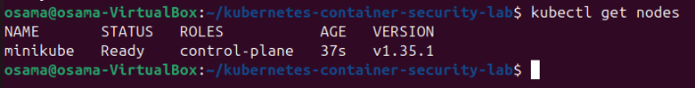
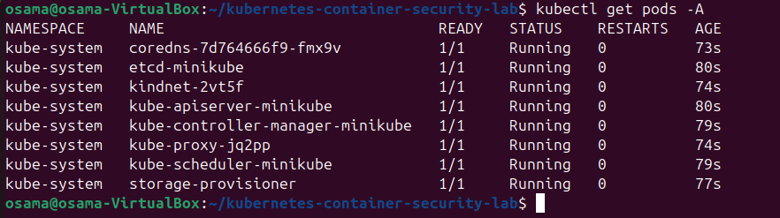
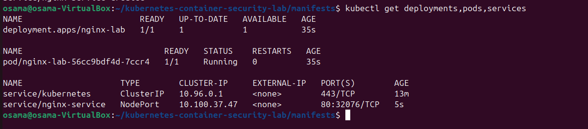
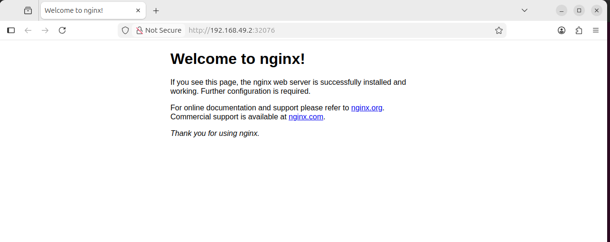
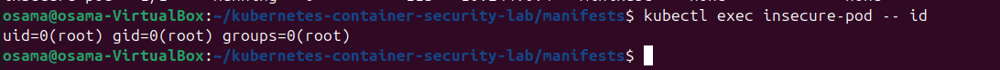
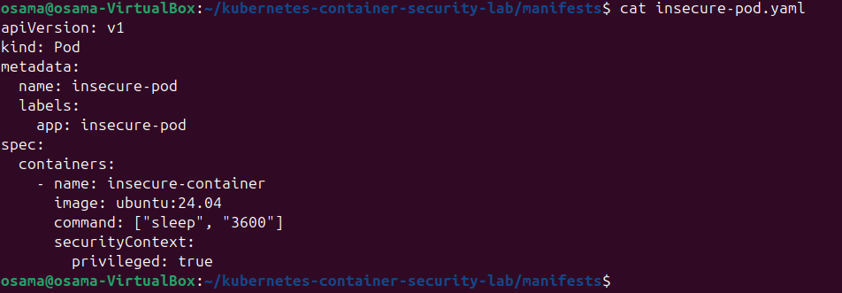
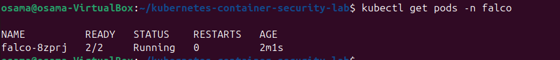

# Kubernetes Container Security and Runtime Detection Lab

A hands-on Kubernetes security project using Minikube, Nginx, Falco, and container hardening techniques.

## Project Status

In Progress

---

# Day 1 - Local Kubernetes Environment

## Goal

Set up a local Kubernetes environment inside an Ubuntu virtual machine and verify that the cluster is functioning correctly.

## Environment

The lab environment consists of:

- Ubuntu 24.04 LTS
- Oracle VirtualBox
- Docker
- kubectl
- Minikube
- Helm
- Git

The virtual machine was configured with:

- 4 CPU cores
- 8 GB RAM
- 50 GB virtual storage

---

## Tools Installed

### Git

Git was installed for project and repository management.

```bash
sudo apt install -y git
```

The installation was verified using:

```bash
git --version
```

---

### Docker

Docker was installed to provide the container environment required by Minikube.

```bash
sudo apt install -y docker.io
```

Docker was enabled and started:

```bash
sudo systemctl enable --now docker
```

The current user was added to the Docker group:

```bash
sudo usermod -aG docker $USER
```

Docker functionality was verified using:

```bash
docker run --rm hello-world
```

The test completed successfully, confirming that Docker was operational.

---

### kubectl

kubectl was installed to allow interaction with the Kubernetes cluster.

```bash
curl -LO "https://dl.k8s.io/release/$(curl -L -s https://dl.k8s.io/release/stable.txt)/bin/linux/amd64/kubectl"
```

The binary was installed using:

```bash
sudo install -o root -g root -m 0755 kubectl /usr/local/bin/kubectl
```

The installation was verified using:

```bash
kubectl version --client
```

---

### Minikube

Minikube was installed to create a local single-node Kubernetes cluster.

```bash
curl -LO https://storage.googleapis.com/minikube/releases/latest/minikube-linux-amd64
```

The Minikube binary was installed using:

```bash
sudo install minikube-linux-amd64 /usr/local/bin/minikube
```

The installation was verified using:

```bash
minikube version
```

---

### Helm

Helm was installed to manage Kubernetes applications and will later be used to deploy Falco.

```bash
curl https://raw.githubusercontent.com/helm/helm/main/scripts/get-helm-3 | bash
```

The installation was verified using:

```bash
helm version
```

---

# Kubernetes Cluster Deployment

The local Kubernetes cluster was created using Minikube.

The Docker driver was selected and the cluster was configured with 4 CPUs and approximately 6 GB of memory.

```bash
minikube start --driver=docker --container-runtime=containerd --cpus=4 --memory=6144
```

Minikube successfully created the Kubernetes cluster and configured kubectl to communicate with it.

---

# Kubernetes Node Verification

The Kubernetes node was checked using:

```bash
kubectl get nodes
```

The Minikube control-plane node successfully reported a:

```text
Ready
```

status.

This confirmed that the Kubernetes control-plane node was operational.

## Evidence



The screenshot above confirms that the Minikube Kubernetes node is running successfully with a `Ready` status.

---

# Kubernetes System Pod Verification

The Kubernetes system components were checked using:

```bash
kubectl get pods -A
```

This command displays pods running across all Kubernetes namespaces.

The Kubernetes system pods were confirmed to be operational.

## Evidence



The screenshot above shows the Kubernetes system components running inside the Minikube cluster.

---

# Day 1 Success Checks

- [x] Ubuntu 24.04 LTS virtual machine configured
- [x] Internet connectivity confirmed
- [x] Git installed
- [x] Docker installed
- [x] Docker functionality verified
- [x] kubectl installed
- [x] Minikube installed
- [x] Helm installed
- [x] Minikube cluster created
- [x] Kubernetes control-plane node is `Ready`
- [x] Kubernetes system pods are operational

---

# Day 1 Result

Day 1 was completed successfully.

A functional local Kubernetes environment was created using Minikube inside an Ubuntu 24.04 LTS virtual machine.

Docker was configured as the local container platform, while kubectl was installed for Kubernetes cluster management. Minikube successfully created the local Kubernetes cluster, and Helm was installed for application deployment later in the project.

The Kubernetes control-plane node was verified as being in a `Ready` state, and the Kubernetes system components were confirmed to be operational.

The environment is now ready for the next stage of the project, where an Nginx workload will be deployed inside Kubernetes.

---

# Next Step

## Day 2 - Deploy the Nginx Workload

The next stage of the project will:

- Create an Nginx Kubernetes Deployment
- Create a Kubernetes Service
- Deploy the Nginx container
- Verify the pod is running
- Access the Nginx website through Minikube
- Document the deployment with screenshots

---

# Authorization

All testing performed as part of this project is conducted inside a self-owned local lab environment for educational and cybersecurity training purposes.

---

# Day 2 - Deploy the Nginx Workload

## Goal

Deploy a simple Nginx web application inside the Kubernetes cluster and verify that it can be accessed successfully.

## Kubernetes Deployment

An Nginx Deployment manifest was created inside the `manifests` directory:

```text
manifests/nginx-deployment.yaml
```

The deployment uses the `nginx:1.27-alpine` container image and runs one replica.

The deployment was applied using:

```bash
kubectl apply -f nginx-deployment.yaml
```

The deployment and pod status were checked using:

```bash
kubectl get deployments,pods
```

The Nginx deployment successfully reported `1/1` ready replicas and the Nginx pod entered the `Running` state.

---

## Kubernetes Service

A NodePort Service was created to expose the Nginx application:

```text
manifests/nginx-service.yaml
```

The service was deployed using:

```bash
kubectl apply -f nginx-service.yaml
```

All Nginx Kubernetes resources were then verified using:

```bash
kubectl get deployments,pods,services
```

The command confirmed that:

- The `nginx-lab` deployment was running
- The Nginx pod was in the `Running` state
- The `nginx-service` NodePort service was successfully created

## Evidence



The screenshot above shows the Nginx Deployment, Pod, and Service running inside the Kubernetes cluster.

---

## Accessing the Nginx Website

The Minikube service command was used to obtain a local URL for the Nginx application:

```bash
minikube service nginx-service --url
```

The generated URL was opened inside the Ubuntu web browser.

The default Nginx welcome page loaded successfully, confirming that traffic could reach the Kubernetes workload through the configured service.

## Evidence



The screenshot above confirms that the Nginx web application is accessible through the Minikube service.

---

## Day 2 Success Checks

- [x] Nginx Deployment manifest created
- [x] Nginx Service manifest created
- [x] Nginx Deployment applied successfully
- [x] Deployment shows `1/1` ready replicas
- [x] Nginx pod is `Running`
- [x] `nginx-service` is available
- [x] Nginx welcome page is accessible
- [x] Kubernetes manifests added to the GitHub repository

---

## Day 2 Result

Day 2 was completed successfully.

An Nginx web application was deployed inside the local Kubernetes cluster using a Kubernetes Deployment. A NodePort Service was then created to expose the workload.

The deployment, pod, and service were verified using kubectl, and the Nginx welcome page was successfully accessed through Minikube.

This confirms that the Kubernetes environment can successfully deploy, run, and expose containerized applications.

---

## Next Step

### Day 3 - Create and Verify an Insecure Pod

The next stage will intentionally deploy an insecure Kubernetes pod in order to demonstrate common container security weaknesses, including:

- Running a container as the root user
- Enabling privileged mode
- Running without resource limits
- Operating without a NetworkPolicy

These weaknesses will later be compared against a hardened Kubernetes workload.

---

# Day 3 - Create and Verify an Insecure Pod

## Goal

Deploy an intentionally insecure Kubernetes pod and identify common container security weaknesses before applying hardening controls.

## Insecure Pod Deployment

An Ubuntu pod was created using:

```text
manifests/insecure-pod.yaml
```

The pod was intentionally configured with privileged mode enabled.

The manifest was deployed using:

```bash
kubectl apply -f insecure-pod.yaml
```

The pod status was checked using:

```bash
kubectl get pod insecure-pod -o wide
```

The pod successfully entered the `Running` state.

---

## Root User Verification

The user identity inside the container was checked using:

```bash
kubectl exec insecure-pod -- id
```

The output confirmed:

```text
uid=0(root)
```

This means the container is running as the root user.

### Security Risk

Running a container as root increases the potential impact of a compromise because processes inside the container have elevated privileges.

### Evidence



---

## Privileged Mode Verification

The pod manifest was inspected and confirmed to contain:

```yaml
securityContext:
  privileged: true
```

### Security Risk

Privileged containers weaken normal container isolation and provide significantly greater access to the underlying environment.

### Evidence



---

## Additional Security Findings

The insecure workload also contains the following weaknesses:

- No CPU resource limits
- No memory resource limits
- No Kubernetes NetworkPolicy

NetworkPolicy configuration was checked using:

```bash
kubectl get networkpolicy
```

No NetworkPolicy was configured at this stage.

---

## Day 3 Success Checks

- [x] Insecure pod deployed
- [x] Pod status is `Running`
- [x] Container confirmed to run as root
- [x] `privileged: true` confirmed
- [x] No resource limits identified
- [x] No NetworkPolicy configured
- [x] Security findings documented
- [x] Evidence screenshots added

---

## Day 3 Result

Day 3 was completed successfully.

An intentionally insecure Kubernetes workload was deployed and inspected. The container was confirmed to run as the root user with privileged mode enabled.

Additional weaknesses were identified, including the absence of CPU and memory limits and the lack of a NetworkPolicy.

These findings create the insecure baseline that will later be compared against a hardened Kubernetes workload.

---

## Next Step

### Day 4 - Install Falco and Capture a Runtime Security Alert

The next stage will introduce runtime security monitoring using Falco.

Falco will be installed into the Kubernetes cluster using Helm, and a controlled test event will be generated inside the Nginx container to confirm that suspicious runtime activity can be detected.

---

# Day 4 - Install Falco and Capture a Runtime Security Alert

## Goal

Install Falco inside the Kubernetes cluster and verify that suspicious runtime activity inside a container can be detected.

---

## Falco Installation

The official Falco Helm repository was added using:

```bash
helm repo add falcosecurity https://falcosecurity.github.io/charts
helm repo update
```

Falco was then installed in a dedicated Kubernetes namespace:

```bash
helm install --replace falco \
  --namespace falco \
  --create-namespace \
  --set tty=true \
  falcosecurity/falco
```

The installation completed successfully with the Falco release deployed into the `falco` namespace.

---

## Falco Pod Verification

The Falco pod was checked for readiness using:

```bash
kubectl wait pods --for=condition=Ready --all -n falco --timeout=180s
```

The pod successfully reached the `Ready` condition.

Falco pod status was then checked using:

```bash
kubectl get pods -n falco
```

The Falco pod was confirmed to be running successfully.

### Evidence



---

## Runtime Detection Test

A controlled security event was generated by accessing the sensitive `/etc/shadow` file from inside the Nginx container:

```bash
kubectl exec -it deployment/nginx-lab -- cat /etc/shadow
```

Falco logs were then reviewed using:

```bash
kubectl logs -n falco -l app.kubernetes.io/name=falco -c falco --since=5m | grep Warning
```

Falco successfully generated a runtime security warning.

The alert identified:

- Sensitive file: `/etc/shadow`
- User: `root`
- Process: `cat`
- Command: `cat /etc/shadow`
- Container: `nginx`
- Image: `nginx:1.27-alpine`
- Kubernetes namespace: `default`
- Kubernetes Nginx pod

### Detection

```text
Warning Sensitive file opened for reading by non-trusted program
```

### Evidence


---

## Security Significance

Access to `/etc/shadow` is security-sensitive because it contains protected user authentication information.

Falco successfully detected this activity at runtime and provided useful investigation context about the process, command, container, image, pod, and namespace involved.

This demonstrates how runtime monitoring can help identify suspicious activity occurring inside Kubernetes workloads.

---

## Day 4 Success Checks

- [x] Falco Helm repository added
- [x] Falco installed using Helm
- [x] Falco namespace created
- [x] Falco pod reached `Ready`
- [x] Falco pod confirmed as `Running`
- [x] Controlled runtime security event generated
- [x] Falco warning successfully captured
- [x] Alert contains container and Kubernetes context
- [x] Falco alert documented
- [x] Evidence screenshots added

---

## Day 4 Result

Day 4 was completed successfully.

Falco was deployed inside the Kubernetes cluster using Helm and confirmed to be operational.

A controlled security event was generated inside the Nginx container by accessing `/etc/shadow`. Falco detected the activity and produced a warning containing useful runtime information, including the process, command, container image, Kubernetes pod, and namespace.

This confirms that the lab environment is capable of detecting suspicious runtime activity inside Kubernetes containers.

---

## Next Step

### Day 5 - Controlled Security Testing

The next stage will perform three controlled security tests:

1. Interactive shell access inside the Nginx container
2. Writing a file below `/etc`
3. Deploying the privileged insecure pod

Each test will be documented with its objective, command, result, security risk, detection status, and recommended mitigation.
