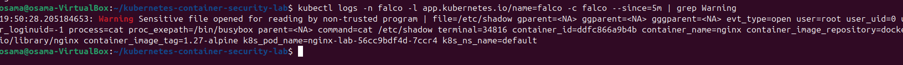

# Falco Runtime Detection Notes

## Day 4 - Runtime Security Detection

### Objective

Verify that Falco can detect suspicious activity occurring inside a Kubernetes container.

### Test Performed

A sensitive system file was accessed from inside the Nginx container using:

```bash
kubectl exec -it deployment/nginx-lab -- cat /etc/shadow
```

Falco logs were then reviewed using:

```bash
kubectl logs -n falco -l app.kubernetes.io/name=falco -c falco --since=5m | grep Warning
```

### Detection Result

Falco successfully generated the following runtime security warning:

```text
Warning Sensitive file opened for reading by non-trusted program
file=/etc/shadow
user=root
process=cat
command=cat /etc/shadow
container_name=nginx
container_image_tag=1.27-alpine
k8s_ns_name=default
```

The alert also identified the specific Nginx Kubernetes pod where the activity occurred.

### Security Significance

Access to `/etc/shadow` is security-sensitive because the file contains protected account password information.

Falco successfully detected the activity at runtime and provided useful investigation context including:

- Accessed file
- User
- Process
- Command
- Container name
- Container image
- Kubernetes pod
- Kubernetes namespace

### Result

**Detected**

Falco successfully identified suspicious access to a sensitive file from inside the Kubernetes Nginx container.

### Evidence


